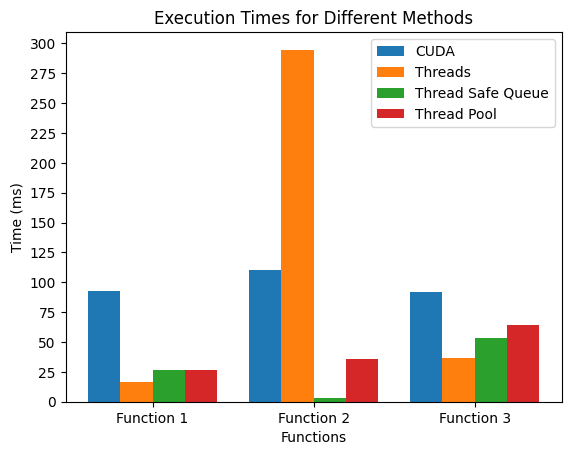

# Lab work extra: CUDA
Authors (team): [Bykov Danylo](https://github.com/DanyaBykov), [Ivan Shevchuk](https://github.com/DoktorTomato), [Maksym Dzoban](https://github.com/MaxDzioban) 
## Prerequisites

- Nvidia GPU with CUDA support
- gcc
- cmake

### Compilation

1. Go into the directory with this repo.
2. Create a build directory ("mkdir build") and go into it ("cd build")
3. In console write "cmake .."
4. In console write "cmake --build ." or "make"
5. Then in the directory "build" run ./integrate_cuda

### Usage

To run the executable you have to go to the directory where it is stored and then type the following command:

- ./integrate_cuda <func_number> <path_to_config_file>

To run test_runner.py you just have to compile the program and then run the following command:

- python3 test_runner.py <times_to_run>

### Results

First of all let`s focus on the specifics of CUDA for this program and how it differs from parallel integral implementation we wrote on one of the previous labs

For functions code itself we have pretty much the same code except for that we need to add __device__ keyword which basiclly tells that this will run on the GPU rather then CPU.
Then for integration we need to change quite a bit as GPU doesn't have threads as on CPU. First of all our integrate function needs to have __global__ keyword which means that this can be called and started from the host (CPU) code. Also instead of using number of threads and creating limits of integration for each thread, we use grid, which creates a grid, from which each thread has it's own block in grid and solves it. So we pass <<<gridSize, blockSize>>>, which basiclly tells the GPU to launch kernel with this parameters, to our integrate function as well as normal arguments. One of the differences also was that we needed to manually allocate device memory and work with it when launching device code. And the last and not least we need to write an atomicAdd to merge the results to exclude any data races.

So enough of code analysis let`s compare CUDA to implementation of standart parallel integral, thread safe queue and thread-pool parallelization implementations.

So based on the graphic above we can see that CUDA is at the level of one of those or a little worse, except for second function where standart parallel implementation is just way worse so it is faster, but this happens because this code was runned on Nvidia gtx titan X which are almost ten years old and even though they are still pretty good, they are obviously worse then new CPUs, so this gives us this results, but still CUDA performms pretty good as the difference between implementations are at most around 50ms which is a pretty good result for 10 year old GPU.
